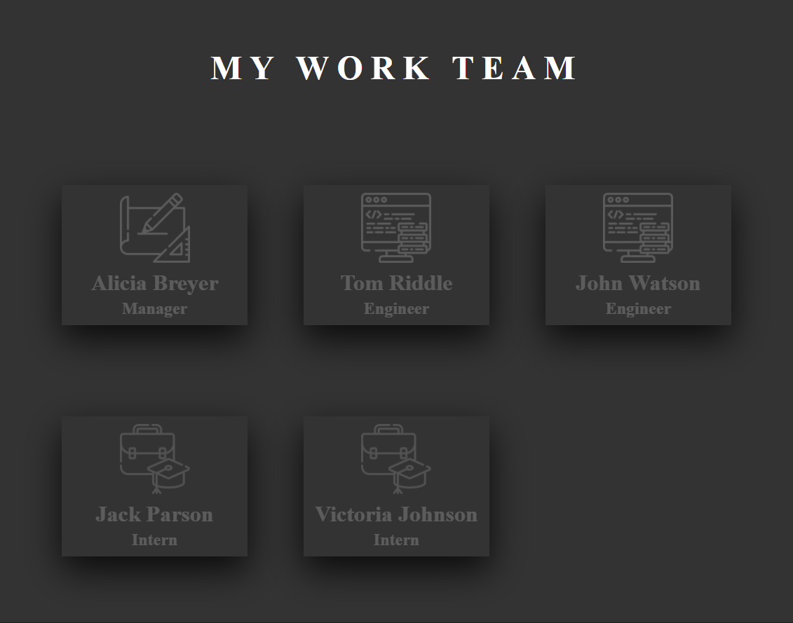
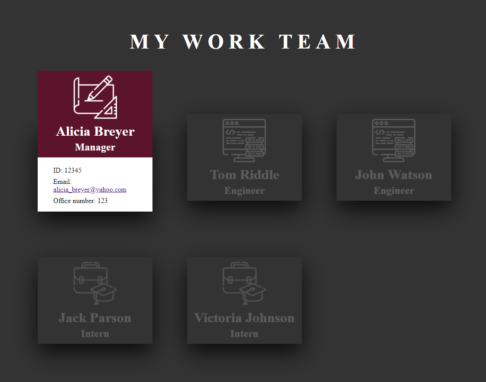

# team-builder

 

## Description

A node.js application that takes user input from inquirer to populate an HTML file based that displays the team's basic info - their names, roles, ids, emails, office numbers, and github repos. The HTML file is created in the dist folder and can be found [here.](./dist/index.html) Test code was also written to make sure class js files functioned properly, and passed using jest in node.js. [Watch the video](https://drive.google.com/file/d/1kjGOJKXABxg16ca-nb_-0d7DUy9O7D7y/view?usp=sharing) to see how to use, or follow the steps.

## How To

- Install dependencies from package.json
- Enter node index.js in terminal
- Answer the prompts
- When all prompts are answered, it will generate an HTML in the dist folder
- To check code using tests, type: npm run test

### Usage Video

[video of how to use team-builder](https://drive.google.com/file/d/1kjGOJKXABxg16ca-nb_-0d7DUy9O7D7y/view?usp=sharing)

### License

MIT License

### Screenshots

